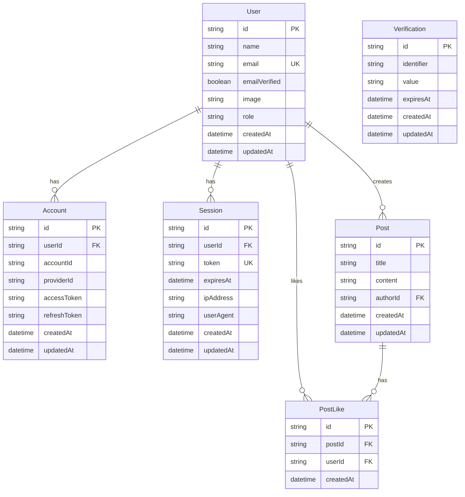

# Data Models & Schema Documentation

> **Note (template direction):** This SPA template no longer ships Prisma, SQLite, or in-repo DB schemas. Keep **authoritative models** in your backend services; use this file only as historical reference or replace it with links to your API/OpenAPI docs.

**Project:** frontend-sample  
**ORM:** Prisma 7.2.0 *(removed from template — see note above)*  
**Database:** SQLite (Development)  
**Analysis Date:** 2025-12-31

---

## Overview

This document catalogs all data models, database schemas, and type definitions used in the `frontend-sample` application. The project uses Prisma ORM with a Better Auth schema for authentication and user management.

---

## Database Configuration

### Prisma Configuration

**Location:** `prisma/schema.prisma`

**Database Provider:** SQLite (configured for easy local development)

```prisma
datasource db {
  provider = "sqlite"
  url      = env("DATABASE_URL")
}

generator client {
  provider = "prisma-client-js"
}
```

**Environment Variable:**

```env
DATABASE_URL="file:./dev.db"
```

### Migration Status

**Current State:** 🟡 Schema defined, migrations ready

**To run migrations:**

```bash
npx prisma migrate dev --name init
npx prisma generate
```

---

## Authentication Schema (Better Auth)

### User Model

**Table:** `User`

**Schema:**

```prisma
model User {
  id            String    @id @default(cuid())
  name          String?
  email         String    @unique
  emailVerified Boolean   @default(false)
  image         String?
  createdAt     DateTime  @default(now())
  updatedAt     DateTime  @updatedAt

  accounts Account[]
  sessions Session[]
}
```

**Fields:**
| Field | Type | Constraints | Description |
|-------|------|-------------|-------------|
| `id` | String | Primary Key, CUID | Unique user identifier |
| `name` | String? | Optional | User's display name |
| `email` | String | Unique, Required | User's email address |
| `emailVerified` | Boolean | Default: false | Email verification status |
| `image` | String? | Optional | Profile image URL |
| `createdAt` | DateTime | Auto-generated | Account creation timestamp |
| `updatedAt` | DateTime | Auto-updated | Last update timestamp |

**Relationships:**

- One-to-Many with `Account` (for OAuth providers)
- One-to-Many with `Session` (active sessions)

**Indexes:**

- Primary: `id`
- Unique: `email`

---

### Account Model

**Table:** `Account`

**Purpose:** Stores OAuth provider accounts linked to users

**Schema:**

```prisma
model Account {
  id                String  @id @default(cuid())
  userId            String
  accountId         String
  providerId        String
  accessToken       String? @default("")
  refreshToken      String? @default("")
  idToken           String? @default("")
  accessTokenExpiresAt DateTime?
  refreshTokenExpiresAt DateTime?
  scope             String? @default("")
  password          String? @default("")
  createdAt         DateTime @default(now())
  updatedAt         DateTime @updatedAt

  user User @relation(fields: [userId], references: [id], onDelete: Cascade)

  @@unique([providerId, accountId])
  @@index([userId])
}
```

**Fields:**
| Field | Type | Constraints | Description |
|-------|------|-------------|-------------|
| `id` | String | Primary Key, CUID | Unique account identifier |
| `userId` | String | Foreign Key → User | Owner of the account |
| `accountId` | String | Required | Provider's account ID |
| `providerId` | String | Required | OAuth provider (google, github, etc.) |
| `accessToken` | String? | Optional | OAuth access token |
| `refreshToken` | String? | Optional | OAuth refresh token |
| `idToken` | String? | Optional | OpenID Connect ID token |
| `accessTokenExpiresAt` | DateTime? | Optional | Access token expiration |
| `refreshTokenExpiresAt` | DateTime? | Optional | Refresh token expiration |
| `scope` | String? | Optional | OAuth scopes |
| `password` | String? | Optional | Hashed password (email/password auth) |
| `createdAt` | DateTime | Auto-generated | Account link timestamp |
| `updatedAt` | DateTime | Auto-updated | Last update timestamp |

**Relationships:**

- Many-to-One with `User` (cascade delete)

**Indexes:**

- Primary: `id`
- Unique: `(providerId, accountId)` composite
- Index: `userId` (for faster joins)

---

### Session Model

**Table:** `Session`

**Purpose:** Stores active user sessions

**Schema:**

```prisma
model Session {
  id        String   @id @default(cuid())
  expiresAt DateTime
  token     String   @unique
  userId    String
  ipAddress String?
  userAgent String?
  createdAt DateTime @default(now())
  updatedAt DateTime @updatedAt

  user User @relation(fields: [userId], references: [id], onDelete: Cascade)

  @@index([userId])
  @@index([token])
}
```

**Fields:**
| Field | Type | Constraints | Description |
|-------|------|-------------|-------------|
| `id` | String | Primary Key, CUID | Unique session identifier |
| `expiresAt` | DateTime | Required | Session expiration time |
| `token` | String | Unique, Required | Session token (JWT or opaque) |
| `userId` | String | Foreign Key → User | Session owner |
| `ipAddress` | String? | Optional | Client IP address |
| `userAgent` | String? | Optional | Client user agent |
| `createdAt` | DateTime | Auto-generated | Session creation timestamp |
| `updatedAt` | DateTime | Auto-updated | Last activity timestamp |

**Relationships:**

- Many-to-One with `User` (cascade delete)

**Indexes:**

- Primary: `id`
- Unique: `token` (for fast lookups)
- Index: `userId` (for user session queries)
- Index: `token` (for authentication)

---

### Verification Model

**Table:** `Verification`

**Purpose:** Stores email verification and password reset tokens

**Schema:**

```prisma
model Verification {
  id         String   @id @default(cuid())
  identifier String
  value      String
  expiresAt  DateTime
  createdAt  DateTime @default(now())
  updatedAt  DateTime @updatedAt

  @@unique([identifier, value])
}
```

**Fields:**
| Field | Type | Constraints | Description |
|-------|------|-------------|-------------|
| `id` | String | Primary Key, CUID | Unique verification identifier |
| `identifier` | String | Required | Email or user identifier |
| `value` | String | Required | Verification token/code |
| `expiresAt` | DateTime | Required | Token expiration time |
| `createdAt` | DateTime | Auto-generated | Token creation timestamp |
| `updatedAt` | DateTime | Auto-updated | Last update timestamp |

**Indexes:**

- Primary: `id`
- Unique: `(identifier, value)` composite

**Use Cases:**

- Email verification tokens
- Password reset tokens
- Magic link tokens

---

## TypeScript Type Definitions

### Entity Types (Not in Database)

The following types are defined in the application code but are not database tables.

#### Finance Types

**Location:** `src/entities/finance/model/types.ts`

```typescript
export interface DashboardStats {
  totalRevenue: number
  totalOrders: number
  averageOrderValue: number
  stats: Stat[]
}

export interface Stat {
  id: string
  label: string
  value: number
  change: string
  trend: 'up' | 'down' | 'neutral'
  icon: string
}

export interface Order {
  id: string
  amount: number
  status: 'pending' | 'processing' | 'completed' | 'failed'
  createdAt: string
}
```

**Storage:**

- **Current:** LocalStorage (mock data)
- **Future:** Database tables (Order, Payment, etc.)

---

#### Session Types

**Location:** `src/entities/session/` (inferred from code)

```typescript
export interface Session {
  user: {
    id: string
    email: string
    name: string
    role: 'admin' | 'moderator' | 'user' | 'guest'
    image?: string
  }
  session: {
    token: string
    expiresAt: string
  }
}
```

**Note:** The `role` field is not in the Prisma schema. To add it:

```prisma
model User {
  // ... existing fields
  role  String  @default("user")  // Add this field
}
```

---

#### Post Types

**Location:** `src/entities/post/` (inferred from code)

```typescript
export interface Post {
  id: string
  title: string
  content: string
  authorId: string
  createdAt: string
  updatedAt: string
  likesCount: number
}

export interface PostLike {
  postId: string
  userId: string
  createdAt: string
}
```

**Database Schema (Proposed):**

```prisma
model Post {
  id        String   @id @default(cuid())
  title     String
  content   String
  authorId  String
  createdAt DateTime @default(now())
  updatedAt DateTime @updatedAt

  author User @relation(fields: [authorId], references: [id], onDelete: Cascade)
  likes  PostLike[]

  @@index([authorId])
}

model PostLike {
  id        String   @id @default(cuid())
  postId    String
  userId    String
  createdAt DateTime @default(now())

  post Post @relation(fields: [postId], references: [id], onDelete: Cascade)
  user User @relation(fields: [userId], references: [id], onDelete: Cascade)

  @@unique([postId, userId])
  @@index([postId])
  @@index([userId])
}
```

---

## Entity Relationship Diagram



---

## Data Access Patterns

### Prisma Client Usage

**Location:** `src/shared/lib/prisma.ts`

```typescript
import { PrismaClient } from '@prisma/client'

const globalForPrisma = globalThis as unknown as {
  prisma: PrismaClient | undefined
}

export const prisma = globalForPrisma.prisma ?? new PrismaClient()

if (process.env.NODE_ENV !== 'production') {
  globalForPrisma.prisma = prisma
}
```

**Usage in API routes:**

```typescript
// Example: Get user by email
const user = await prisma.user.findUnique({
  where: { email: 'user@example.com' },
  include: {
    accounts: true,
    sessions: true,
  },
})

// Example: Create session
const session = await prisma.session.create({
  data: {
    token: generateToken(),
    expiresAt: new Date(Date.now() + 7 * 24 * 60 * 60 * 1000),
    userId: user.id,
  },
})

// Example: Delete expired sessions
await prisma.session.deleteMany({
  where: {
    expiresAt: {
      lt: new Date(),
    },
  },
})
```

---

## Data Validation

### Zod Schemas

**Location:** `src/shared/lib/validation/schemas.ts`

The application uses Zod for runtime data validation.

**User Validation:**

```typescript
export const userSchema = z.object({
  id: z.string().cuid(),
  name: z.string().min(1).max(100).optional(),
  email: z.string().email(),
  emailVerified: z.boolean(),
  image: z.string().url().optional(),
  role: z.enum(['admin', 'moderator', 'user', 'guest']),
})

export type UserSchema = z.infer<typeof userSchema>
```

**Session Validation:**

```typescript
export const sessionSchema = z.object({
  user: userSchema,
  session: z.object({
    token: z.string().min(1),
    expiresAt: z.string().datetime(),
  }),
})
```

**Auth Validation:**

```typescript
export const signInSchema = z.object({
  email: z.string().email('Please enter a valid email address'),
  password: z.string().min(6, 'Password must be at least 6 characters'),
})

export const signUpSchema = z.object({
  email: z.string().email('Please enter a valid email address'),
  password: z.string().min(6, 'Password must be at least 6 characters'),
  name: z.string().min(1, 'Name is required').max(100),
})
```

---

## Database Migrations

### Current Migrations

**Status:** 🟡 No migrations run yet (fresh install)

**To initialize database:**

```bash
# Create and apply initial migration
npx prisma migrate dev --name init

# Generate Prisma Client
npx prisma generate

# Open Prisma Studio to view data
npx prisma studio
```

### Migration Best Practices

1. **Development:**

   ```bash
   npx prisma migrate dev --name descriptive_name
   ```

2. **Production:**

   ```bash
   npx prisma migrate deploy
   ```

3. **Reset (Development Only):**
   ```bash
   npx prisma migrate reset
   ```

---

## Data Seeding

### Seed Script (Proposed)

**Location:** `prisma/seed.ts` (not yet created)

```typescript
import { PrismaClient } from '@prisma/client'
import { hash } from 'bcryptjs'

const prisma = new PrismaClient()

async function main() {
  // Create admin user
  const admin = await prisma.user.upsert({
    where: { email: 'admin@example.com' },
    update: {},
    create: {
      email: 'admin@example.com',
      name: 'Admin User',
      emailVerified: true,
      accounts: {
        create: {
          accountId: 'admin_account',
          providerId: 'credential',
          password: await hash('password123', 10),
        },
      },
    },
  })

  console.log({ admin })
}

main()
  .catch(e => {
    console.error(e)
    process.exit(1)
  })
  .finally(async () => {
    await prisma.$disconnect()
  })
```

**Run seed:**

```bash
npx prisma db seed
```

---

## Future Schema Extensions

### Proposed Models

#### Payment Model

```prisma
model Payment {
  id            String   @id @default(cuid())
  orderId       String
  amount        Decimal  @db.Decimal(10, 2)
  currency      String   @default("USD")
  status        String   // pending, processing, completed, failed
  method        String   // card, paypal, etc.
  userId        String
  createdAt     DateTime @default(now())
  updatedAt     DateTime @updatedAt

  user User @relation(fields: [userId], references: [id], onDelete: Cascade)

  @@index([userId])
  @@index([orderId])
}
```

#### Reward Model

```prisma
model Reward {
  id        String   @id @default(cuid())
  userId    String
  points    Int
  type      String   // purchase, referral, bonus
  createdAt DateTime @default(now())

  user User @relation(fields: [userId], references: [id], onDelete: Cascade)

  @@index([userId])
}
```

#### Notification Model

```prisma
model Notification {
  id        String   @id @default(cuid())
  userId    String
  type      String   // info, success, warning, error
  message   String
  read      Boolean  @default(false)
  createdAt DateTime @default(now())

  user User @relation(fields: [userId], references: [id], onDelete: Cascade)

  @@index([userId])
  @@index([read])
}
```

---

## Data Storage Summary

| Model            | Status      | Storage       | Purpose            |
| ---------------- | ----------- | ------------- | ------------------ |
| `User`           | ✅ Defined  | Prisma/SQLite | User accounts      |
| `Account`        | ✅ Defined  | Prisma/SQLite | OAuth providers    |
| `Session`        | ✅ Defined  | Prisma/SQLite | Active sessions    |
| `Verification`   | ✅ Defined  | Prisma/SQLite | Email/reset tokens |
| `Post`           | 🟡 Proposed | N/A           | User posts         |
| `PostLike`       | 🟡 Proposed | N/A           | Post likes         |
| `Payment`        | 🟡 Proposed | N/A           | Payment records    |
| `Reward`         | 🟡 Proposed | N/A           | User rewards       |
| `Notification`   | 🟡 Proposed | N/A           | User notifications |
| `DashboardStats` | 🔴 Mock     | LocalStorage  | Dashboard metrics  |
| `Order`          | 🔴 Mock     | LocalStorage  | Orders             |

**Legend:**

- ✅ Defined - Schema exists in Prisma
- 🟡 Proposed - TypeScript types exist, schema needed
- 🔴 Mock - Currently simulated data

---

## Database Performance Considerations

### Indexes

**Current Indexes:**

- `User.email` - Unique index for email lookups
- `Account.userId` - Foreign key index for joins
- `Account.(providerId, accountId)` - Composite unique index
- `Session.userId` - Foreign key index for joins
- `Session.token` - Unique index for authentication
- `Verification.(identifier, value)` - Composite unique index

**Query Optimization:**

- All foreign keys are indexed
- Frequently queried fields have indexes
- Composite indexes for multi-field lookups

### Connection Pooling

**Prisma Client Configuration:**

```typescript
// src/shared/lib/prisma.ts
export const prisma = new PrismaClient({
  log: process.env.NODE_ENV === 'development' ? ['query', 'error', 'warn'] : ['error'],
})
```

**Production Configuration:**

```typescript
export const prisma = new PrismaClient({
  datasources: {
    db: {
      url: process.env.DATABASE_URL,
    },
  },
  log: ['error'],
})
```

---

## Conclusion

The `frontend-sample` project uses a **well-structured Prisma schema** focused on authentication and user management. The Better Auth integration provides a solid foundation for secure authentication.

**Key Strengths:**

- ✅ Type-safe database access with Prisma
- ✅ Comprehensive auth schema (Better Auth standard)
- ✅ Proper relationships and cascade deletes
- ✅ Indexed foreign keys for performance
- ✅ Runtime validation with Zod

**Next Steps:**

1. Run initial database migration
2. Add `role` field to User model
3. Implement proposed Post, Payment, Reward models
4. Create seed script for development data
5. Add database backups and migration strategy for production

---

**Database Schema Version:** 1.0.0 (Initial)  
**Last Updated:** 2025-12-31
